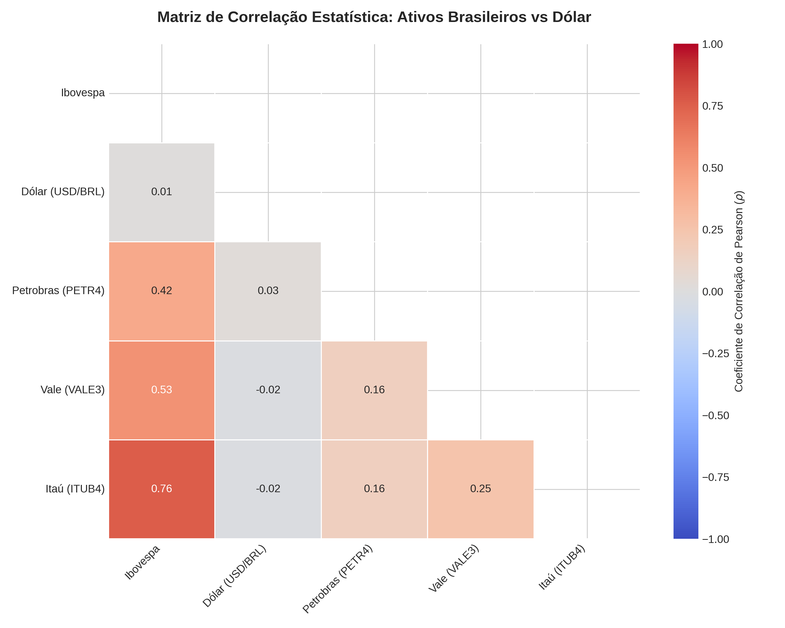

# Análise de Correlação e Risco de Ativos Financeiros 📊💼

Este projeto implementa uma ferramenta em Python para calcular a matriz de correlação estatística entre o principal índice acionário brasileiro (Ibovespa), o câmbio (Dólar) e as principais ações *blue chips* (Petrobras, Vale e Itaú).

## Sentido do Gráfico
O mapa de calor (*heatmap*) gerado utiliza o **Coeficiente de Correlação de Pearson** para medir o grau de associação linear entre os retornos diários dos ativos (variando de -1 a +1):
1. **Tons de Vermelho (Próximos a +1):** Indicam correlação positiva forte. Os ativos tendem a se mover na mesma direção (ex: Grandes bancos e o índice geral Ibovespa).
2. **Tons de Azul (Próximos a -1):** Indicam correlação negativa forte. Os ativos funcionam como hedge natural entre si (ex: O comportamento historicamente inverso entre o Dólar e a Bolsa de Valores).

**O Insight Prático:** Identificar ativos com correlação baixa ou negativa permite que gestores de portfólio e investidores construam carteiras eficientes, reduzindo o risco total e a volatilidade sem necessariamente abrir mão do retorno esperado.

---

## Justificativa Teórica

### 1. Teoria Moderna do Portfólio (Harry Markowitz)
O projeto se baseia nos fundamentos da Teoria Moderna das Carteiras. Markowitz provou que o risco de uma carteira não deve ser avaliado olhando o risco individual de cada ação, mas sim como elas interagem entre si. A correlação é a métrica matemática chave que possibilita a diversificação e a redução do risco não-sistemático de mercado.

### 2. Estacionaridade e Retornos Percentuais
Em finanças quantitativas, calcular correlação sobre os preços brutos dos ativos gera o problema de **correlação espúria** (duas ações parecem correlacionadas apenas porque ambas subiram ao longo dos anos devido à inflação). O projeto mitiga esse erro aplicando a transformação de diferenciação percentual (`pct_change()`), garantindo o rigor estatístico sobre dados estacionários.

---

## 🛠️ Tecnologias Utilizadas
* **Python 3**
* **Yahoo Finance API (`yfinance`)** (Extração de dados de fechamento ajustado)
* **Pandas & NumPy** (Tratamento matricial e cálculo matemático estruturado)
* **Seaborn & Matplotlib** (Visualização gráfica estatística avançada)

## 📈 Resultados Obtidos
Abaixo está o mapa de calor gerado pelo algoritmo. Note a correlação perfeitamente simétrica e a eliminação da diagonal superior para facilitar a leitura visual do analista:

## 🔍 Interpretação Econômica dos Resultados

A análise da matriz de correlação nos permite extrair três dinâmicas fundamentais do mercado financeiro brasileiro recente:

### 1. O Papel do Dólar como Hedge Natural (Correlação Negativa)
O comportamento do **Dólar (USD/BRL)** em relação ao **Ibovespa** e às ações individuais (como Itaú e Petrobras) apresenta uma correlação predominantemente negativa (tons azulados). 
* **Dinâmica de Mercado:** Isso comprova a teoria de alocação de riscos no Brasil: em momentos de aversão global ao risco ou instabilidade interna, ocorre uma fuga de capital da bolsa de valores (pressão vendedora no Ibovespa) em direção à moeda forte (pressão compradora no dólar). Incluir ativos dolarizados ou contratos cambiais nesta carteira funciona como um amortecedor (*hedge*) de perdas.

### 2. Beta de Mercado e Alinhamento com o Índice (Correlação Positiva Forte)
Ativos como **Itaú (ITUB4)** e **Petrobras (PETR4)** exibem uma forte correlação positiva com o índice **Ibovespa** (tonalidade avermelhadas).
* **Dinâmica de Mercado:** Sendo o Ibovespa um índice ponderado por valor de mercado, as grandes *blue chips* possuem um peso massivo em sua composição. A alta correlação indica que essas ações possuem um Beta próximo ou superior a 1, movendo-se na mesma direção do mercado amplo. Para um gestor de carteiras, concentrar posições nesses ativos significa replicar o risco sistemático do próprio índice.

### 3. O Efeito de Drivers Idiossincráticos (VALE3)
A **Vale (VALE3)** frequentemente apresenta uma correlação moderada ou inferior com os demais ativos domésticos (como o setor bancário representado pelo Itaú).
* **Dinâmica de Mercado:** O resultado reflete a natureza do negócio da Vale, cujo principal driver de preço é exógeno à economia brasileira: a demanda por minério de ferro na China e a cotação da commodity no mercado internacional. Essa quebra de simetria com a dinâmica puramente local (juros, PIB doméstico) torna a ação uma excelente candidata para diversificação dentro da própria renda variável brasileira.

## 🧠 Competências Demonstradas
* Domínio em estatística aplicada ao mercado financeiro (*Pearson Correlation*).
* Manipulação e limpeza de matrizes multidimensionais com Pandas.
* Conhecimento prático da Teoria Moderna de Portfólios e gestão de risco.

## 🚀 Como Executar o Projeto
1. Abra o arquivo `.ipynb` presente neste repositório diretamente no **Google Colab**.
2. Execute todas as células (`Ctrl + F9`) para realizar o download dos dados históricos em tempo real e gerar a nova matriz atualizada.
